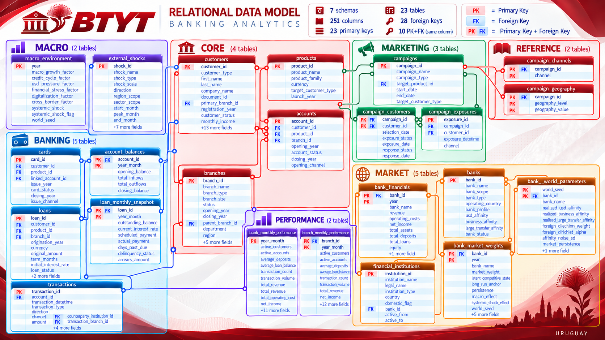

  

<h1 align="center">BTYT Banking Analytics</h1>

  <strong>End-to-end synthetic banking analytics project built around a fictional Uruguayan commercial bank.</strong>

  Python · PostgreSQL · SQL · Power BI · Excel · Tableau · Credit Risk / ML

Overview

Banco de Treinta y Tres (BTYT) is a fictional Uruguayan commercial bank created as the analytical universe for an end-to-end data project.

The project covers the full path from synthetic data generation to relational modeling, SQL analytics, KPI design, business intelligence, and later credit-risk modeling.

All data is synthetic, but the system is designed to preserve coherent relationships, temporal dynamics, business rules, accounting identities, and operational behavior.

Fiction, yes. Fantasy, no.

Status

Completed

Reproducible synthetic banking universe with deterministic configuration.

15-stage generation pipeline and cross-system validation.

PostgreSQL ingestion and final seven-schema relational model.

23 tables, 251 columns, 23 PKs, 28 FKs, 11 audited NOT NULL rules, 27 CHECK constraints.

55 / 55 tracked historical constraints validated.

Thematic SQL analytics 00–07 completed, audited, runtime-tested, and frozen.

Banking KPI catalog completed and frozen.

KPI SQL implementation completed and frozen.

Current milestone — Part I: Portfolio-Ready BI & Analytics

Frozen PostgreSQL model
        ↓
Frozen thematic SQL 00–07
        ↓
Frozen KPI catalog + KPI SQL
        ↓
Reusable analytical views        ← NEXT
        ↓
Power BI + DAX
        ↓
Focused Python analysis
        ↓
Advanced Excel workbook
        ↓
Tableau geographic storytelling
        ↓
Portfolio documentation

Part I includes: analytical views, Power BI, Power Query, DAX, focused Python notebooks, advanced Excel, Tableau, and final portfolio documentation.

Backlog / outside the first portfolio-ready release: Apache Superset, Docker / Docker Compose, Pentaho, MLOps infrastructure, and extreme SQL performance tuning.

Project Scope

Part I — Business Intelligence & Performance Management

Part I analyzes the synthetic banking universe across:

customers

products and accounts

deposits and lending

credit quality

transactions and channels

branches

campaigns

bank-wide performance and profitability

geographic patterns

Primary tools: PostgreSQL + SQL, Power BI + DAX, Python, Excel, Tableau.

Part II — Credit Risk Analytics & Machine Learning

Part II will reuse the same frozen banking universe for:

SQL-based feature extraction

exploratory credit-risk analysis

feature engineering

statistical modeling

machine learning

evaluation and explainability

experiment tracking and scoring infrastructure

No disconnected replacement dataset will be created.

PostgreSQL Model

The final relational model contains:

Component

Count

Schemas

7

Tables

23

Columns

251

Primary keys

23

Foreign keys

28

Audited NOT NULL

11

CHECK constraints

27

Historical constraints validated

55 / 55

  

Schemas

Schema

Tables

Role

core

4

Customers, branches, products, accounts

banking

5

Cards, loans, transactions, balances, loan snapshots

marketing

3

Campaigns, targeting, exposure, response

reference

2

Campaign dimensions

market

5

Banks, institutions, market dynamics

macro

2

Macroeconomic environment and shocks

performance

2

Aggregated BTYT bank and branch performance

Important grains:

transactions                 → one transaction
account_balances             → one account × month
loan_monthly_snapshot        → one loan × month
bank_financials              → one bank × year
bank_monthly_performance     → one BTYT observation × month
branch_monthly_performance   → one branch × month

Lower-level monetary tables preserve native currency (UYU, USD). The performance schema uses UYU-equivalent reporting values.

PostgreSQL Pipeline

load_postgresql.py
        ↓
audit_relational_model.py
        ↓
apply_relational_model.py
        ↓
validate_relational_model.py

The pipeline handles ingestion, relational auditing, semantic typing, monetary precision, PK/FK creation, NOT NULL, CHECK constraints, schema reorganization, and final validation.

Detailed documentation lives under docs/sqlprocess/.

SQL Analytical Layer

The SQL layer has two frozen components under scripts/sql/.

Thematic exploration

000_sql_cheatsheet.sql
00_structural_context.sql
01_customers.sql
02_products_accounts.sql
03_loans.sql
04_transactions.sql
05_branches.sql
06_campaigns.sql
07_performance.sql
README_FREEZE.md

KPI layer

kpis/
├── 01_*.sql
├── 02_*.sql
├── 03_*.sql
├── 04_*.sql
├── 05_*.sql
├── 06_*.sql
├── 07_*.sql
└── README.md

Do not reopen SQL architecture or KPI definitions unless a real bug or justified downstream requirement appears.

KPI Layer

The KPI catalog and its SQL implementation are complete and frozen for Part I.

The KPI layer covers:

scale and customer relationships

deposits and lending

revenue and efficiency

credit quality and delinquency

profitability

branch performance

transactions and channels

campaign performance

synthetic market position

Each KPI documents its business meaning, grain, temporal and currency semantics, source objects, priority tier, and preferred downstream tool.

The frozen KPI layer now acts as the specification for analytical views, DAX, Python, Excel, and Tableau.

Analytical Principles

Build once at the data layer. Analyze where it makes sense. Visualize where it communicates best. Do not duplicate without purpose.

Decision sequence:

Required grain?

Reusable preparation? → SQL

Dynamic BI metric? → DAX

Ingestion / light shaping? → Power Query

Statistical / exploratory? → Python

Best communication layer? → Power BI / Tableau / Excel

Core semantics

Master status vs historical state
Customer, account, card, loan, and branch statuses are cutoff attributes unless documented otherwise. Historical behavior comes from snapshots and performance tables.

Stock vs flow
Stocks and semi-additive measures such as active customers, active accounts, average deposits, average loan balance, and closing balances must not be blindly summed across time. Flows such as revenue, costs, credit loss, transaction count, and transaction volume can normally be accumulated.

Transactions

FAILED     → attempted operational event
COMPLETED  → executed economic event

Financial transaction volume uses COMPLETED transactions only.

Campaigns
A POSITIVE response is an observed campaign response, not automatically a product conversion.

Synthetic World

Analytical observation window:

January 2021 → December 2026

Some relationships begin earlier to represent inherited historical state.

Approximate canonical world size:

~107,000 customers

37 branches / agencies

~76.8 million transaction rows

Generated production data is intentionally excluded from normal Git history.

World architecture

World Name + Variant
        ↓
Deterministic Seed
        ↓
World Configuration
        ↓
15-Stage Pipeline
        ↓
Cross-System Audit
        ↓
Manifest + Fingerprint
        ↓
Frozen Analytical World

Worlds are isolated under:

worlds/<WORLD>/<VARIANT>/

The project also includes a desktop BTYT World Builder for configuring and launching synthetic worlds.

Development launch command:

.\.venv\Scripts\python.exe -m world_builder.app

Generation Pipeline

#

Stage

1

macro

2

banks

3

financial_institutions

4

branches

5

customers

6

accounts

7

cards

8

loans

9

loan_snapshot

10

external_shocks

11

transactions

12

campaigns

13

branch_performance

14

operational_exports

15

cross_system_audit

The orchestrator uses fresh subprocesses and fail-fast execution by default.

Banking Universe

BTYT does not generate disconnected random tables. Outcomes emerge from interacting mechanisms such as customer heterogeneity, product preferences, account ownership, branch relationships, digital adoption, lending behavior, delinquency, seasonality, market evolution, external shocks, and controlled data-quality degradation.

Branch network

BTYT contains 37 structurally defined branches and agencies across Uruguay, differing by geography, type, size, history, administrative parent, strategic importance, and closure risk.

Transactions

The transaction engine supports transfers, debit purchases, service payments, cash operations, loan payments, interest credits, and loan disbursements. It also models channel adoption, failed attempts, counterparties, branch usage, internal transfer pairing, and balance reconciliation.

Loans and credit quality

Monthly loan snapshots track outstanding balance, interest rate, scheduled and actual payments, DPD, delinquency status, and arrears.

Canonical DPD buckets:

CURRENT
DPD_1_30
DPD_31_60
DPD_61_90
DPD_90_PLUS

Performance layer

Management measures include customers, accounts, deposits, loans, transactions, interest income and expense, fee income, operating costs, credit losses, pre-provision profit, and net income.

Accounting identities:

Net Interest Income
= Interest Income - Interest Expense

Total Revenue
= Net Interest Income + Fee Income

Pre-Provision Profit
= Total Revenue - Total Operating Cost

Net Income
= Pre-Provision Profit - Credit Loss

Bank and branch performance reconcile by month.

BI & Analytical Layer

Python
→ synthetic banking universe

PostgreSQL + SQL
→ relational foundation and reusable analytical data

Power BI + DAX
→ primary corporate BI and executive analytics

Python / Pandas / Jupyter
→ statistical and exploratory analysis

Excel
→ management reporting and ad-hoc analysis

Tableau
→ geographic and spatial storytelling

Apache Superset is not part of the first portfolio-ready release and remains in backlog.

Power BI

Primary BI product for Part I. Planned areas:

Executive Overview

Customers

Products & Accounts

Loans & Credit Quality

Transactions & Channels

Branch Performance

Campaign Performance

Python

Used selectively for analyses that add value beyond SQL and BI, including distributions, outliers, concentration, delinquency transitions, loan trajectories, anomalies, and macro/performance relationships.

Excel

Advanced management workbook using Power Query, PivotTables, formulas, scorecards, variance analysis, and scenario/sensitivity analysis.

Tableau

Focused on geography and spatial storytelling: branch network, regional volume, regional profitability, campaign coverage, and response geography.

Tableau complements Power BI rather than reproducing it.

Repository Structure

btyt-banking-analytics/
├── config/
├── resources/reference/
├── worlds/<WORLD>/<BTYT>/
├── scripts/
│   ├── core/
│   ├── generators/
│   ├── audits/
│   ├── database/
│   ├── sql/
│   │   ├── 000_sql_cheatsheet.sql
│   │   ├── 00_structural_context.sql
│   │   ├── 01_customers.sql
│   │   ├── 02_products_accounts.sql
│   │   ├── 03_loans.sql
│   │   ├── 04_transactions.sql
│   │   ├── 05_branches.sql
│   │   ├── 06_campaigns.sql
│   │   ├── 07_performance.sql
│   │   ├── README_FREEZE.md
│   │   └── kpis/
│   ├── generate_btyt.py
│   └── generate_manifest.py
├── world_builder/
├── docs/
│   ├── architecture/
│   ├── analytics/
│   ├── data_dictionary/
│   └── sqlprocess/
└── README.md

Technology Stack

Implemented: Python, Pandas, NumPy, PyArrow / Parquet, PostgreSQL, SQL, SQLAlchemy, Psycopg, Git / GitHub, CustomTkinter, deterministic RNG architecture, cross-system auditing, relational validation, thematic SQL analytics, KPI SQL.

Current stage: analytical views → Power BI / Power Query / DAX → Python notebooks → advanced Excel → Tableau.

Later / optional: Apache Superset, Docker / Compose, Pentaho, scikit-learn, credit-risk ML, explainability, MLflow, local scoring service.

Technologies are added to the implemented stack only when their corresponding project stage is completed.

Main Analytical Question — Part I

How is BTYT performing, and where are the main opportunities and risks across its customers, deposits, products, loans, branches, channels, campaigns, and banking relationships?

Part I answers this through validated SQL, reusable analytical structures, frozen banking KPIs, BI dashboards, geographic analysis, profitability analysis, and focused statistical exploration.

Disclaimer

BTYT is a fictional bank created exclusively for educational and portfolio purposes.

All customers, accounts, cards, loans, transactions, balances, branch behavior, market behavior, financial values, campaign outcomes, and credit events are synthetic.

The project contains no real customer data, confidential banking information, or actual bank transaction records.

Real financial-institution names may appear only as structural references. Synthetic metrics associated with them must not be interpreted as actual reported results or observed market behavior.

Author

Santiago Castillo Marsicano
Economics & Sociology
Data Analytics | Business Intelligence